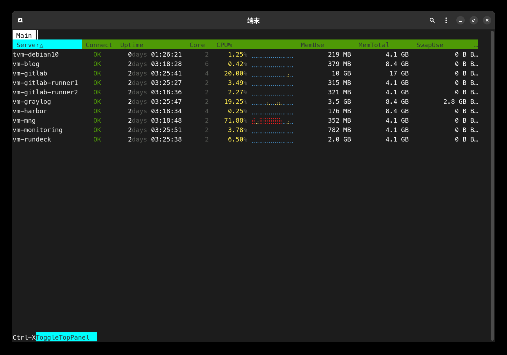
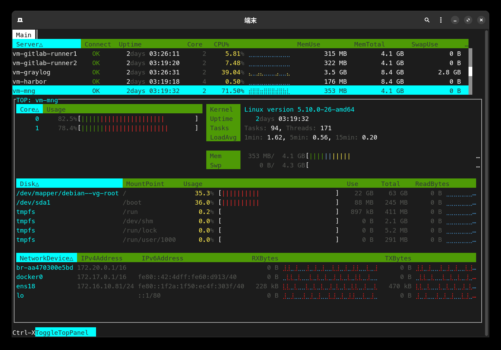

lsmon
===

**lsmon** is a tool that allows performance monitoring by obtaining CPU and memory usage from hosts over SSH.

<p align="center">

</p>

<p align="center">

</p>

This tool is a related project of [lssh](https://github.com/blacknon/lssh). It uses the same configuration file as **lssh**.

## Features

- Select the destination host from the list
- You can check the CPU and memory usage of multiple hosts via SSH
- Automatically attempts to reconnect if the connection is lost
- Can use the same configuration as [lssh](https://github.com/blacknon/lssh)

## Installation

To install `lsmon`, clone the repository and build it using Go.

```bash
git clone https://github.com/blacknon/lsmon.git
cd lsmon
go build
```

## Usage

To start lsmon, run the following command.

```bash
lsmon
```

## License

This project is licensed under the MIT License - see the [LICENSE](LICENSE) file for details.
